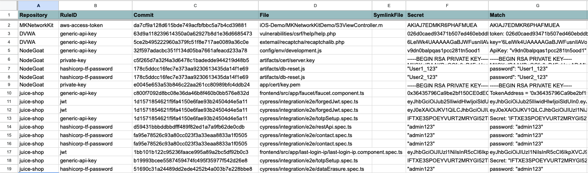
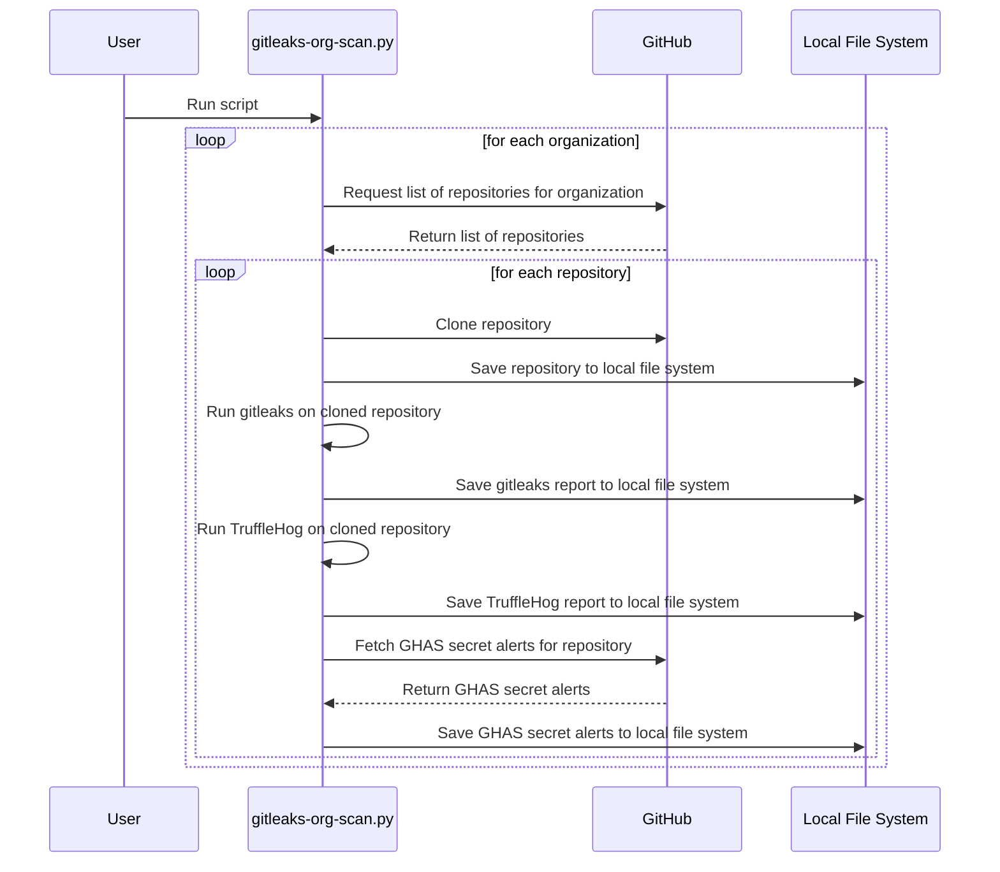

# gitleaks-utils

gitleaks-utils, in its current form, is a utility for evaluating discovered secrets across multiple orgs, and repositories. The name gitleaks-utils is a bit misleading since it requires the following tools:

* gitleaks
* trufflehog
* Github Advanced Security
* Github

## Why gitleaks-utils?

In short, to help you: 

* Identify what secrets scanning solution(s) to use
* Know how many secrets may be discovered in your repositories (like a dry run)
* Identify true positives and remediate them before rolling out an alerting system
* Identify false positives and tune your alerting system to eliminate noisy alerts

# License

This project is licensed under the MIT License - see the [LICENSE](LICENSE) file for details.

## Pre-requisites

* Python 3.6+
* `git` installed and in your PATH
* A Github account with sufficient permissions to access the target repositories
* A Github access token with sufficient permissions get a listing of repositories from the Github REST API
* `gitleaks` installed and in your PATH
* 'trufflehog' installed and in your PATH

## Installation

1. Clone this repository:

`git clone https://github.com/yourusername/yourrepository.git`

2. Install the required Python packages:

`pip install -r requirements.txt`

3. Install [Gitleaks](https://github.com/zricethezav/gitleaks)

## Usage

Here's the command-line help:

```
usage: gitleaks-org-scan.py [-h] [--clean] [--dry-run] [--org-type {users,orgs}] [--owners OWNERS]

optional arguments:
  -h, --help            show this help message and exit
  --clean               delete the directories ./checkouts and ./reports. When --clean is present all other commands are
                        ignored.
  --dry-run             run the script in dry run mode, don't execute any commands
  --keep-secrets-in-reports
                        Keep plain text secrets in the aggregated reports. By default the tool will hash secrets for final reports if this flag is missing.
  --repos-internal-type
                        If your repositories are internal, this flag will be added when fetching repositories from Github.
  --open-report-in-browser
                        Open the report in a browser after it's generated
  --org-type {users,orgs}
                        set the organization type
  --owners OWNERS       comma-delimited list of owners
  --skip-noseyparker    Skip the Noseyparker scan
  --skip-trufflehog     Skip the TruffleHog scan
  --skip-ghas           Skip the GitHub Advanced Security scan
  --skip-gitleaks       Skip the Gitleaks scan
```

1. Set your GitHub access token as an environment variable:

`export GITHUB_ACCESS_TOKEN=youraccesstoken`

See [Managing your personal access tokens](https://docs.github.com/en/authentication/keeping-your-account-and-data-secure/managing-your-personal-access-tokens) for more information. You will only need the ability to list repositories so the script will know what to checkout via `git checkout`

2. Review [.gitleaks.toml](./org-scan/.gitleaks.toml) for path and file exclusions. Modify as necessary.

Gitleaks can generate a lot of false positives out of the box. So review results carefully and add exclusions as necessary to minimize false positives.

3. Run the script from the `org-scan` directory:

Here are some examples of use cases for running the script:

Example: Running on a personal owner account:

`python3 gitleaks-org-scan.py --org-type users --owners austimkelly`

Example: Running on a personal owner account and keeping plain text secrets in the output:

`python3 gitleaks-org-scan.py --org-type users --owners austimkelly --keep-secrets-in-reports`

Example: Running on multiple organizations:

`python3 gitleaks-org-scan.py --org-type orgs --owners org1,org2,org3`

Note: Multiple Github Personal Access Tokens are not supported yet.

Example: Cleaning up source and scanning artifacts:

`python3 gitleaks-org-scan.py --clean`

## Reports

After the script has finished running, you can find the consolidated reports in the `./reports/reports_<YYYYMMDDHHMM>` directory. An HTML file in that directory contains a short summary of the results and the raw artifacts (CSV) and error log for any tool failures you want to investigate.

Here's an example of the output:



## org-scan call sequence



# Gitleaks as a Github Action

This repository also contains a Github Action that can be used to scan a repository for secrets using Gitleaks. The action is located in the [.github/actions/gitleaks](.github/workflows/gitleaks.yml) directory. 

NOTE: That running gitleaks against a repo owned by a user is free. A repository owned by an organization will require a free API key. See [Obtaining a Gitleaks License](https://gitleaks.io/products.html)

# References

* [Gitleaks](https://gitleaks.io/)
* [TruffleHog](https://github.com/trufflesecurity/trufflehog)
* [Github Advanced Security](https://docs.github.com/en/github/getting-started-with-github/about-github-advanced-security)
* [A Comparative Study of Software Secrets Reporting by Secret Detection Tools](https://arxiv.org/pdf/2103.01946.pdf)
* [SecretBench](https://github.com/setu1421/SecretBench) - Reference data set used by the comparative paper above.
* [secrets-magpie](https://github.com/punk-security/secret-magpie) - A similar tool to this one with more source scanning options.

## Github Action References
* [gitleaks on Github](https://github.com/gitleaks/gitleaks)
* [gitleaks Github Action](https://github.com/gitleaks/gitleaks-action)

# Limitations and Known Issues

* The script does not support multiple Github Personal Access Tokens yet. When pulling GHAS Secert Alerts for multiple orgs, this will only use one token.
* Internal repositories are treated with a separate flag. If you have a mix of internal, private, and public repositories in an org, you will have incomplete results.
* Matching does not happen with GHAS Secret Alerts. The API does not return secrets, line or file numbers in the alerts. As such, you cannot compare in an automated fashion to other tools run localhost.