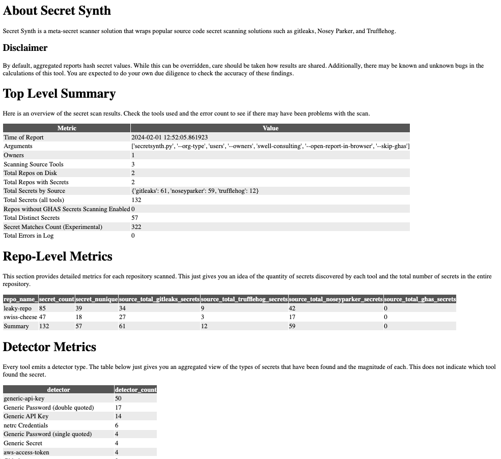
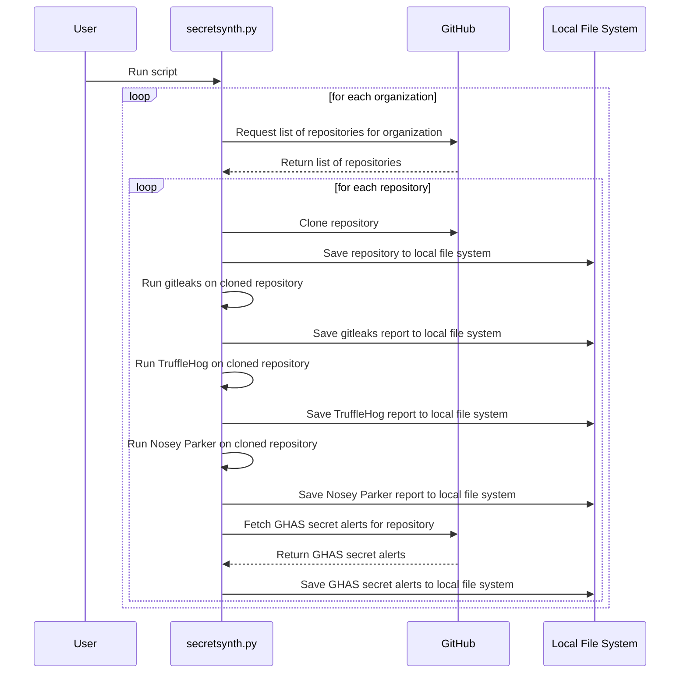

[](https://github.com/austimkelly/secretsynth/actions/workflows/unit_tests.yml)

# 🕵️ Secret Synth

<span style='font-family: "Lucida Console";line-height: 14px;font-size: 14px;display: inline-block;'>┏━━━┓━━━━━━━━━━━━━━━━┏┓━┏━━━┓━━━━━━━━━━┏┓━┏┓━━<br>┃┏━┓┃━━━━━━━━━━━━━━━┏┛┗┓┃┏━┓┃━━━━━━━━━┏┛┗┓┃┃━━<br>┃┗━━┓┏━━┓┏━━┓┏━┓┏━━┓┗┓┏┛┃┗━━┓┏┓━┏┓┏━┓━┗┓┏┛┃┗━┓<br>┗━━┓┃┃┏┓┃┃┏━┛┃┏┛┃┏┓┃━┃┃━┗━━┓┃┃┃━┃┃┃┏┓┓━┃┃━┃┏┓┃<br>┃┗━┛┃┃┃━┫┃┗━┓┃┃━┃┃━┫━┃┗┓┃┗━┛┃┃┗━┛┃┃┃┃┃━┃┗┓┃┃┃┃<br>┗━━━┛┗━━┛┗━━┛┗┛━┗━━┛━┗━┛┗━━━┛┗━┓┏┛┗┛┗┛━┗━┛┗┛┗┛<br>━━━━━━━━━━━━━━━━━━━━━━━━━━━━━┏━┛┃━━━━━━━━━━━━━<br>━━━━━━━━━━━━━━━━━━━━━━━━━━━━━┗━━┛━━━━━━━━━━━━━<br></span>
    
A python-based tool for discovering secrets with multiple secret scanning solutions across multiple orgs, and repositories. Secret Synth leverages the following secret scanning tools:

* gitleaks
* trufflehog
* Github Advanced Security
* Nosey Parker

Only pulls from GitHub are currently supported.

## ❓ Why Secret Synth?

In short, to help you: 

* Identify what secrets scanning solution(s) and strategy you may want to deploy.
* Know how many secrets may be discovered in your repositories (like a dry run).
* Identify classes of secrets that are being identified in your source code.
* Identify true positives and remediate them before rolling out a secrets alerting solution.
* Identify false positives and tune your alerting system to eliminate noisy alerts (which decreases developer productivity).

# 📄 License

This project is licensed under the MIT License. See the [LICENSE](LICENSE) file for details. As such, the software is provided "as-is" and without warranty. The authors are not responsible for any damages or liabilities that may arise from the use of the software.

## Pre-requisites

* Python 3.6+
* A Github account with sufficient permissions to access the target repositories
* A Github access token with sufficient permissions get a listing of repositories from the Github REST API
* `git` installed and in your PATH
* `gitleaks` installed and in your PATH
* `trufflehog` installed and in your PATH
* `noseyparker` installed and in your PATH

### Versions

The following versions were used during development:

* noseyparker, [v0.16.0](https://github.com/praetorian-inc/noseyparker/releases/tag/v0.16.0).
* gitleaks, [v8.18.1](https://github.com/gitleaks/gitleaks/releases/tag/v8.18.1)
* trufflehog, [v3.66.2](https://github.com/trufflesecurity/trufflehog/releases/tag/v3.66.2)
* GitHub REST API, [API Version 2022-11-28](https://docs.github.com/en/rest?apiVersion=2022-11-28)

## Installation

1. Clone this repository:

`git clone https://github.com/yourusername/yourrepository.git`

2. Install the required Python packages:

`pip install -r requirements.txt`

3. Install the other required secrets scanners.

## 🛠️ Usage

Here's the command-line help:

```
usage: secretsynth.py [-h] [--clean] [--dry-run] [--keep-secrets-in-reports] [--repos-internal-type]
                      [--org-type {users,orgs}] [--owners OWNERS] [--skip-noseyparker] [--skip-trufflehog]
                      [--skip-ghas] [--skip-gitleaks] [--open-report-in-browser]
optional arguments:
  -h, --help            show this help message and exit
  --clean               delete the directories ./checkouts and ./reports. When --clean is present all other commands are
                        ignored.
  --dry-run             run the script in dry run mode, don't execute any commands
  --keep-secrets-in-reports
                        Keep plain text secrets in the aggregated reports. By default the tool will hash secrets for final reports if this flag is missing.
  --repos-internal-type
                        If your repositories are internal, this flag will be added when fetching repositories from Github.
  --open-report-in-browser
                        Open the report in a browser after it's generated
  --org-type {users,orgs}
                        set the organization type
  --owners OWNERS       comma-delimited list of owners
  --skip-noseyparker    Skip the Noseyparker scan
  --skip-trufflehog     Skip the TruffleHog scan
  --skip-ghas           Skip the GitHub Advanced Security scan
  --skip-gitleaks       Skip the Gitleaks scan
  --open-report-in-browser
                        Open the report in a browser after it's generated
```

1. Set your GitHub access token as an environment variable:

`export GITHUB_ACCESS_TOKEN=youraccesstoken`

See [Managing your personal access tokens](https://docs.github.com/en/authentication/keeping-your-account-and-data-secure/managing-your-personal-access-tokens) for more information. You will only need the ability to list repositories so the script will know what to checkout via `git checkout`

2. Review [.gitleaks.toml](./org-scan/.gitleaks.toml) for path and file exclusions. Modify as necessary.

Gitleaks can generate a lot of false positives out of the box. So review results carefully and add exclusions as necessary to minimize false positives.

3. Run the `secretsynth` script from the `org-scan` directory:

## Sample Command-Line Executions

Here are some examples of use cases for running the script:

**Example**: Running on a personal owner account:

🚀🚀 This example uses some small open source repos with secrets in them. Hence, this is a good test for you to quickly evaluate the setup is correct for your environment. 🚀🚀

`python3 secretsynth.py --org-type users --owners swell-consulting --skip-ghas --open-report-in-browser`

**Example**: Running on a personal owner account and keeping plain text secrets in the output, but omit trufflehog from the execution:

`python3 secretsynth.py --org-type users --owners austimkelly --keep-secrets-in-reports --skip-trufflehog`

**Example**: Running on multiple organizations:

`python3 secretsynth.py --org-type orgs --owners org1,org2,org3`

Note: Multiple Github Personal Access Tokens are not supported yet.

**Example**: Cleaning up source and scanning artifacts:

`python3 secretsynth.py --clean`

## 📈 Analyzing Results

After the script has finished running, you can find the consolidated reports in the `./org-scan/reports/reports_<YYYYMMDDHHMM>` directory. An HTML file in that directory contains a short summary of the results, CSV artifacts with merged alerts, and an error log for any tool failures you want to investigate.

Here's an example of the output:



You can further analyze the data in your favorite spreadsheet or data warehouse:


# 🏗️ Call sequence diagram



# ⚙️ Github Actions with Secrets Scanners

## Gitleaks as a Github Action

This repository also contains a Github Action that can be used to scan a repository for secrets using Gitleaks. The action is located in the [.github/actions/gitleaks](.github/workflows/gitleaks.yml) directory. 

NOTE: That running gitleaks against a repo owned by a user is free. A repository owned by an organization will require a free API key. See [Obtaining a Gitleaks License](https://gitleaks.io/products.html)

## Trufflehog as a Github Action

See [Trufflehog Github Action](https://github.com/marketplace/actions/trufflehog-oss)

# 📚 References

* [Gitleaks](https://gitleaks.io/)
* [TruffleHog](https://github.com/trufflesecurity/trufflehog)
* [Github Advanced Security](https://docs.github.com/en/github/getting-started-with-github/about-github-advanced-security)
* [A Comparative Study of Software Secrets Reporting by Secret Detection Tools](https://arxiv.org/pdf/2103.01946.pdf)
* [SecretBench](https://github.com/setu1421/SecretBench) - Reference data set used by the comparative paper above.
* [secrets-magpie](https://github.com/punk-security/secret-magpie) - A similar tool to this one with more source scanning options.
* [Meet Nosey Parker — An Artificial Intelligence Based Scanner That Sniffs Out Secrets](https://www.praetorian.com/blog/nosey-parker-ai-secrets-scanner-release/) - Some really good data science work here on the precision of Nosey Parker.

# ⚠️ Limitations and Known Issues

* The script does not support multiple Github Personal Access Tokens yet. When pulling GHAS Secert Alerts for multiple orgs, this will only use one token.
* Internal repositories are treated with a separate flag. If you have a mix of internal, private, and public repositories in an org, you will have incomplete results.
* Matching does not happen with GHAS Secret Alerts. The API does not return secrets, line or file numbers in the alerts. As such
* Only clones from Github are supported. Adding filesystem and other repos could be done upon request.