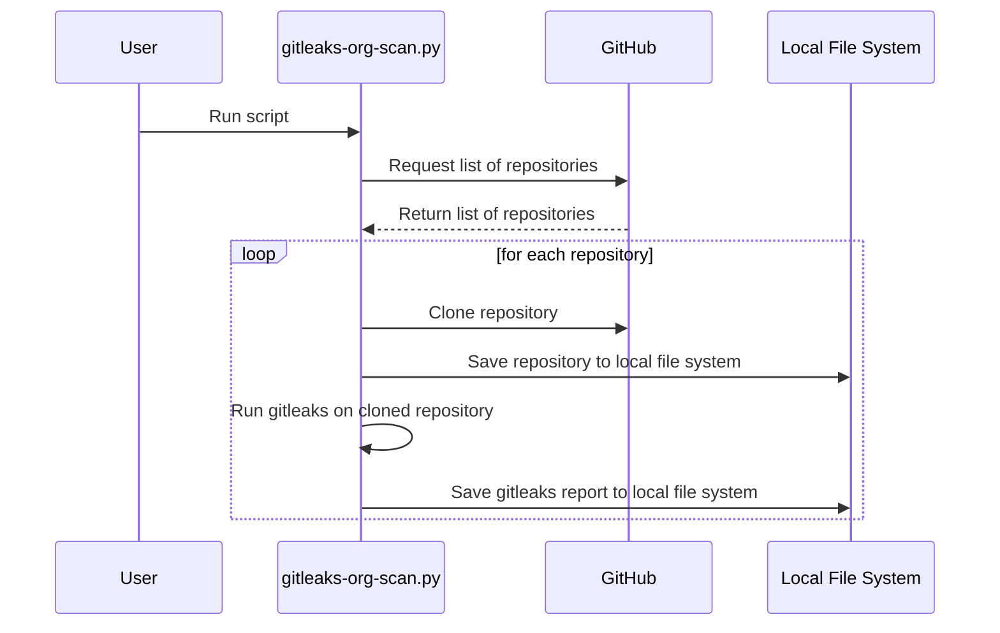

# gitleaks-utils
Some utils for making gitleaks easier to working with -- in some specific conditions

# License

This project is licensed under the MIT License - see the [LICENSE](LICENSE) file for details.

# Gitleaks Organization Scan Utility

One of the utilities included in this package is `gitleaks-org-scan.py`. This script is designed to scan all repositories of a specified GitHub user or organization for secrets using `gitleaks`, and generates a consolidated report of all findings in a single CSV.

This is a useful exercise before enabling new secrets scanning tools as scale across a large number of repositories. You want to minimize false positives as much as possible before enabling a new tool.

## Pre-requisites

* Python 3.6+
* `git` installed and in your PATH
* A Github account with sufficient permissions to access the target repositories
* A Github access token with sufficient permissions get a listing of repositories from the Github REST API
* `gitleaks` installed and in your PATH

## Installation

1. Clone this repository:

`git clone https://github.com/yourusername/yourrepository.git`

2. Install the required Python packages:

`pip install -r requirements.txt`

3. Install [Gitleaks](https://github.com/zricethezav/gitleaks)

## Usage

Here's the command-line help:

```
usage: gitleaks-org-scan.py [-h] [--clean] [--dry-run] [--org-type {users,orgs}] [--owners OWNERS]

optional arguments:
  -h, --help            show this help message and exit
  --clean               delete the directories ./checkouts and ./reports. When --clean is present all
                        other commands are ignored.
  --dry-run             run the script in dry run mode, don't execute any commands
  --org-type {users,orgs}
                        set the organization type
  --owners OWNERS       comma-delimited list of owners
```

1. Set your GitHub access token as an environment variable:

`export GITHUB_ACCESS_TOKEN=youraccesstoken`

See [Managing your personal access tokens](https://docs.github.com/en/authentication/keeping-your-account-and-data-secure/managing-your-personal-access-tokens) for more information. You will only need the ability to list repositories so the script will know what to checkout via `git checkout`

2. Review [.gitleaks.toml](./org-scan/.gitleaks.toml) for path and file exclusions. Modify as necessary.

Gitleaks can generate a lot of false positives out of the box. So review results carefully and add exclusions as necessary to minimize false positives.

3. Run the script from the `org-scan` directory:

Example: Running on a personal owner account:

`python3 gitleaks-org-scan.py --org-type users --owners austimkelly`

Example: Running on multiple organizations:

`python3 gitleaks-org-scan.py --org-type orgs --owners org1,org2,org3`

Example: Cleaning up source and scanning artifacts:

`python3 gitleaks-org-scan.py --clean`

## Reports

After the script has finished running, you can find the consolidated report in the `report_concat.csv` file in the working directory. Individual reports for each repository are located in the `./reports` directory.

Here's an example of the output:


## org-scan call sequence



# Gitleaks as a Github Action

This repository also contains a Github Action that can be used to scan a repository for secrets using Gitleaks. The action is located in the [.github/actions/gitleaks](.github/workflows/gitleaks.yml) directory. 

NOTE: That running gitleaks against a repo owned by a user is free. A repository owned by an organization will require a free API key. See [Obtaining a Gitleaks License](https://gitleaks.io/products.html)

# References

* [gitleaks on Github](https://github.com/gitleaks/gitleaks)
* [gitleaks Github Action](https://github.com/gitleaks/gitleaks-action)